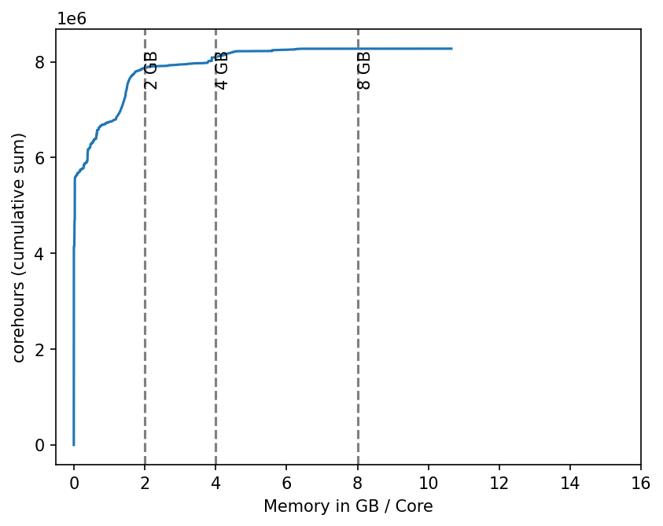

# sacct-MemoryPerCore
A python script to go through `sacct` data and study memory requirements in GB / core.

The result is a general and per-`Account` visualization of memory requirements of past jobs.
A cumulative sum of all corehours in a cluster shows how many jobs may need more than 2 GB, 4 GB or 8 GB of memory per core.



## Workflow and Limitations
The script just calls `sacct --allusers` in a subprocess.
So you do need permission to read all slurmdb data.

To not overload the slurmdb with requests, the script steps through the requested time period on a weekly basis.
This is not very efficient and takes some time.
Successful `sacct` calls are filtered into a polars dataframe and cached as parquet files in a `cache` subfolder to allow for quick re-run when changing plot styles etc.

Jobs at the beginning and end of a period may not be treated well. For example overlapping run times on 01.01. may be counted in the previous and the following year.
There is no check for it, since the error is very likely negligible in our cluster. (Many small HTC workloads)
The cached weeks may also result in some weeks not counted correctly.
E.g. 2022-W52 may be the first cache file for 2023, so the whole week instead of a single day of that week could count towards 2023.

The script also does not filter by job states, so all jobs are counted. This includes jobs that terminate due to failure, timeout, OOM, etc.
They may not contribute much in terms of corehours.
You can argue for both, to visualize all jobs that actually were present on the cluster or only jobs that ran well.
Here, we visualize all jobs that were ever present.

MaxRSS is only reported on individual job steps, so technically the cumulative sum of corehours is for job steps and not whole jobs!
I think the result is still useful, though.

## Setup
```bash
# In case you want to use a specific Python version
module load 2025 GCCcore/14.3.0 Python/3.13.5
python -m venv .venv
source .venv/bin/activate
pip install -r requirements.txt
# Add time periods you are interested in in the scripts __main__ method
./sacct-MemoryPerCore.py
```
